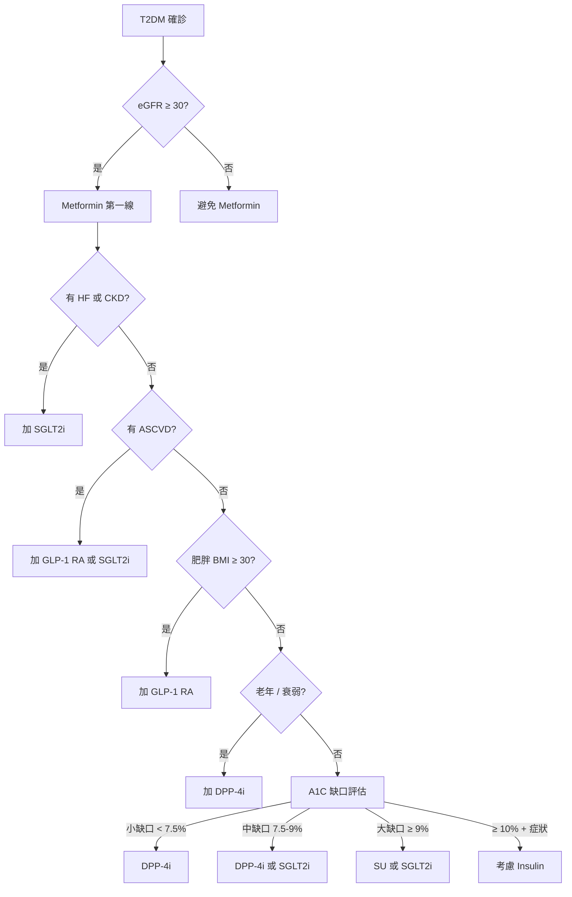

# 口服降血糖藥（OHA）完整比較與選擇指引

**Oral Hypoglycemic Agents (OHA) — Comprehensive Comparison & Selection Guide**

---

<OhaSelectionGuide />

## 核心治療架構

T2DM 治療以 **Metformin 為第一線**，依據共病症、A1C 目標、患者偏好選擇第二線藥物。

> 2025 臺灣共識：有 ASCVD / HF / CKD 者，**Metformin 後優先選 SGLT2i 或 GLP-1 RA**（無論 A1C）。

## 選藥決策流程

## A1C 治療閾值與藥物啟動時機

| A1C 數值                             | 建議行動                                               |
| ------------------------------------ | ------------------------------------------------------ |
| **≥ 6.5%**（確診）                   | 新診斷、無 ASCVD/HF/CKD → **Metformin** + 生活型態調整 |
| **≥ 7.5–8.0%**                       | 考慮**雙藥治療**（Metformin + 另一類）                 |
| **≥ 8.5–9.0%**                       | 考慮**三藥治療**或注射製劑                             |
| **≥ 9.0–10%** 伴隨症狀或分解代謝特徵 | **胰島素**第一線                                       |

- 若有 ASCVD/HF/CKD：**無論 A1C 數值**（即使 6.5%），應啟動 SGLT2i 或 GLP-1 RA
- 若 A1C 超過目標值 > 1.5%：考慮直接起始複方治療

## 共病導向之首選藥物

| 共病                              | Metformin 後首選                           | 原因                               |
| --------------------------------- | ------------------------------------------ | ---------------------------------- |
| **ASCVD**（CAD, CVA, PAD）        | **GLP-1 RA** 或 **SGLT2i**                 | CV 事件降低（EMPA-REG, LEADER 等） |
| **HF**（HFrEF/HFmrEF/HFpEF）      | **SGLT2i**（dapa/empa）                    | HF 住院 ↓ 30%                      |
| **CKD**（eGFR 25–75, uACR ≥ 200） | **SGLT2i**（dapa/empa）                    | 腎臟保護（DAPA-CKD, EMPA-KIDNEY）  |
| **肥胖**（BMI ≥ 30）              | **GLP-1 RA**（semaglutide, tirzepatide）   | 體重下降 10–20%                    |
| **NAFLD/MASH**                    | **GLP-1 RA**（或 Pioglitazone）            | 減少脂質堆積、發炎                 |
| **老年**（衰弱、跌倒風險）        | **DPP-4i**                                 | 最低低血糖風險                     |
| **經濟考量**                      | **SU**（gliclazide/glimepiride）或 **TZD** | 便宜、可取得性高                   |
| **嚴重胰島素阻抗**                | **TZD**（Pioglitazone）                    | 改善胰島素敏感度                   |

## 優先順序

| 線別                        | 藥物                            | 理由                                                |
| --------------------------- | ------------------------------- | --------------------------------------------------- |
| **1st**                     | **Metformin**                   | 療效、安全性、體重中性、CV 獲益、低成本、60+ 年資料 |
| **2nd**（共病驅動）         | **SGLT2i**（若 ASCVD/HF/CKD）   | 器官保護、減重、低低血糖風險                        |
| **2nd**（共病驅動）         | **GLP-1 RA**（若 ASCVD/肥胖）   | CV 獲益、減重、低低血糖風險                         |
| **2nd**（A1C 驅動，無共病） | **DPP-4i / SU / TZD / AGI**     | 依患者 profile 選擇                                 |
| **3rd+**                    | **Insulin**（basal → prandial） | 最強效，β 細胞衰竭後最終選擇                        |

## 各類藥物副作用與病人考量

| 類別          | 病人面向好處                             | 副作用                                                              | 關鍵衛教                                             |
| ------------- | ---------------------------------------- | ------------------------------------------------------------------- | ---------------------------------------------------- |
| **Metformin** | 體重中性、便宜、60 年安全紀錄、↓ CV 事件 | GI 不適（腹瀉、噁心）、金屬味、B12 缺乏                             | 隨餐服用；ER 可減 GI 不適；監測 B12                  |
| **SGLT2i**    | 減重、降血壓、HF/CKD 保護、低低血糖      | **UTI、生殖器黴菌感染**、體液流失、euglycemic DKA、Fournier（極罕） | 多喝水；sick day rule；術前停藥；**會陰疼痛 = 急診** |
| **GLP-1 RA**  | 顯著減重、CV 保護、低低血糖              | **噁心嘔吐腹瀉**（常見）、膽囊疾病、胰臟炎（罕）                    | 低劑量起始緩慢調升；注射給藥；成本高                 |
| **DPP-4i**    | 耐受佳、無低血糖、體重中性               | **鼻咽炎、頭痛**、關節痛（罕）、HF 風險（saxa）                     | 方便（口服 QD）；效果較弱                            |
| **SU**        | 強效、快速、極便宜                       | **低血糖**（老年最大風險）、體重增加、β 細胞耗竭                    | 衛教低血糖症狀；避免用於老年衰弱者                   |
| **TZD**       | 持久療效、↓ 胰島素阻抗、NAFLD            | 體重增加、水腫、**骨折風險**、膀胱癌警示、HF 惡化                   | 避免用於 NYHA III–IV HF；監測 LFT；老年女性考慮 DEXA |
| **AGI**       | 安全、餐後血糖控制                       | **排氣、腹脹**（耐受性差）                                          | 隨第一口飯咀嚼服用                                   |

## 各類藥物完整比較

### 1. 雙胍類 Biguanides

| 項目         | Metformin IR                                              | Metformin ER                  |
| ------------ | --------------------------------------------------------- | ----------------------------- |
| 作用機轉     | ↓肝臟糖質新生，↑周邊胰島素敏感度                          | 同 IR，但緩釋                 |
| 劑量         | 500–850 mg BID–TID                                        | 500–1000 mg QD–BID            |
| 最大劑量     | 2550 mg/day                                               | 2000 mg/day                   |
| HbA1c 降幅   | **↓ 1.0–1.5%**                                            | 同 IR                         |
| 低血糖風險   | **極低**（單獨使用）                                      | 同 IR                         |
| 體重影響     | 中性或 ↓                                                  | 中性                          |
| 腎功能限制   | eGFR ≥ 30                                                 | eGFR ≥ 30                     |
| 優點         | 60+ 年經驗，CV 獲益（UKPDS），便宜，不促胰島素分泌        | 較少 GI 副作用                |
| 缺點         | GI 不適（腹瀉、噁心），B12 缺乏，乳酸中毒（極罕見）       | 較貴                          |
| 臺灣常見商品 | 庫魯化（Glucophage），泌特糖（Mitex），速糖平（Diatrust） | 庫魯化緩釋錠（Glucophage XR） |

#### 同型比較 — Metformin IR vs ER

| 面向       | IR 優勢       | ER 優勢                   |
| ---------- | ------------- | ------------------------- |
| GI 耐受性  | —             | ✅ 顯著較佳（腹瀉 ↓ 50%） |
| 價格       | ✅ 最便宜     | 較貴                      |
| 服藥順從性 | BID–TID       | ✅ QD–BID                 |
| 劑量靈活性 | ✅ 可精細調整 | 劑型固定                  |
| 療效       | 同等          | 同等                      |

> **選擇建議**：IR 做為起始（成本考量），若出現 GI 不耐受則轉 ER。ER 可整顆吞服不可嚼碎。

### 2. 磺醯尿素類 Sulfonylureas

| 項目         | Gliclazide MR                                 | Glimepiride      | Glipizide            | Glibenclamide (Glyburide)          |
| ------------ | --------------------------------------------- | ---------------- | -------------------- | ---------------------------------- |
| 作用機轉     | ↑β細胞 insulin 分泌（K-ATP 通道阻斷）         |
| 劑量         | 30–120 mg QD                                  | 1–6 mg QD        | 2.5–20 mg QD–BID     | 2.5–15 mg QD–BID                   |
| 半衰期       | ~12–20 h                                      | ~5–9 h           | ~2–4 h               | ~10 h                              |
| HbA1c 降幅   | ↓ 1.0–1.5%                                    | ↓ 1.0–1.5%       | ↓ 1.0–1.5%           | ↓ 1.0–1.5%                         |
| 低血糖風險   | **中**                                        | **高**           | **中**               | **最高**⚠️                         |
| 體重增加     | ~2 kg                                         | ~2–3 kg          | ~2 kg                | ~2–3 kg                            |
| 腎功能       | eGFR ≥ 30                                     | eGFR ≥ 30（慎）  | eGFR ≥ 30（慎）      | **避免**（eGFR < 60 風險↑）        |
| CV 安全性    | ✅ 中性（ADVANCE）                            | 中性             | 中性                 | ⚠️ 爭議（四十年資料無明確危害）    |
| 優點         | 低血糖風險最低之 SU，CV 安全資料明確，QD 服藥 | 強效，便宜       | 短效可靈活調整       | 最強效                             |
| 缺點         | 較貴（原廠）                                  | 低血糖風險高     | BID 服藥，老年不適合 | **低血糖風險最高**，不建議老年使用 |
| 臺灣常見商品 | 岱蜜克龍 MR（Diamicron MR）                   | 安免癲（Amaryl） | 泌得樂（Glidiab）    | 優爾康（Euglucon）                 |

#### 同型比較 — 如何選 SU

| 情境            | 首選              | 原因                                |
| --------------- | ----------------- | ----------------------------------- |
| 一般患者        | **Gliclazide MR** | 最低低血糖風險，QD，CV 安全資料充分 |
| 需強效降糖      | **Glimepiride**   | 降糖效價最高                        |
| 老年/腎功能不全 | **Gliclazide MR** | 低血糖風險相對低，但 eGFR < 30 應停 |
| 餐後血糖為主    | **Glipizide**     | 短效，可隨餐服用                    |
| 不應使用        | **Glibenclamide** | 低血糖風險最高，尤其腎功能下降者    |

> **核心原則**：SU 類以 Gliclazide MR 為首選（安全與療效平衡最佳）。Glibenclamide 應逐漸淘汰。

### 3. DPP-4 Inhibitors

| 項目         | Sitagliptin                                           | Vildagliptin         | Saxagliptin                       | Linagliptin          | Alogliptin                          |
| ------------ | ----------------------------------------------------- | -------------------- | --------------------------------- | -------------------- | ----------------------------------- |
| 作用機轉     | ↑ incretin（GLP-1, GIP）半衰期，↑ insulin、↓ glucagon |
| 劑量         | 100 mg QD                                             | 50 mg BID            | 5 mg QD                           | 5 mg QD              | 25 mg QD                            |
| 腎調劑       | eGFR < 45 → 50 mg QD                                  | eGFR < 30 → 50 mg QD | eGFR < 45 → 2.5 mg QD             | **不需**             | eGFR < 60 → 12.5 mg；< 30 → 6.25 mg |
| HbA1c 降幅   | ↓ **0.5–0.8%**                                        | ↓ 0.5–0.8%           | ↓ 0.5–0.8%                        | ↓ 0.5–0.8%           | ↓ 0.5–0.8%                          |
| 低血糖風險   | **極低**                                              | 極低                 | 極低                              | 極低                 | 極低                                |
| 體重影響     | 中性                                                  | 中性                 | 中性                              | 中性                 | 中性                                |
| CV 安全性    | ✅ 中性（TECOS）                                      | ✅ 中性              | ⚠️ **HF 住院 ↑**（SAVOR-TIMI 53） | ✅ 中性（CARMELINA） | ✅ 中性（EXAMINE）                  |
| 特殊考量     | 資料最多                                              | BID 服藥             | HF 警示                           | 無腎調劑             | 較少使用                            |
| 優點         | 耐受性最佳，低血糖極少，不影響體重，方便（QD）        | GLP-1 ↑ 較顯著       | —                                 | 腎功能不全不需調劑   | 肝代謝少                            |
| 缺點         | 效果最弱類別之一，昂貴                                | BID 順從性較差       | HF 安全性訊號                     | 昂貴                 | 臨床證據較少                        |
| 臺灣常見商品 | 佳糖維（Januvia）                                     | 高糖優適（Galvus）   | 昂格莎（Onglyza）                 | 糖漸平（Trajenta）   | 尼釋（Nesina）                      |

#### 同型比較 — 如何選 DPP-4i

| 情境                | 首選             | 原因                                     |
| ------------------- | ---------------- | ---------------------------------------- |
| 一般患者            | **Sitagliptin**  | 最多資料，CV 安全，QD，已有學名藥較便宜  |
| 老年 / CKD          | **Linagliptin**  | **唯一不需腎調劑**（無膽汁、腎雙重排泄） |
| 需微量加強 incretin | **Vildagliptin** | BID 給藥維持 GLP-1 濃度較平穩            |
| **不應使用**        | **Saxagliptin**  | HF 住院風險增加，除非無其他選擇          |

> **DPP-4i 定位**：最安全的用藥之一，但因效果較弱，主要用於 elderly、需避免低血糖者，或作為 combo 中的第三線。

### 4. Thiazolidinediones（TZD）

| 項目         | Pioglitazone                                        |
| ------------ | --------------------------------------------------- |
| 作用機轉     | PPAR-γ agonist，↑脂肪/肌肉/肝臟胰島素敏感度         |
| 劑量         | 15–45 mg QD                                         |
| HbA1c 降幅   | ↓ **0.8–1.2%**                                      |
| 低血糖風險   | **極低**（單獨使用）                                |
| 體重增加     | **~2–4 kg**（水腫 + 脂肪增加）                      |
| CV 安全性    | ✅ 中性，↓ CV 事件趨勢（PROactive）                 |
| 心衰竭風險   | ⚠️ **↑ HF 住院**（水鈉滯留）                        |
| 骨折風險     | ⚠️ ↑（女＞男，遠端）                                |
| 肝功能影響   | 需監測 LFT                                          |
| 膀胱癌       | ⚠️ 可能風險↑（長期研究尚有爭議）                    |
| 優點         | 持久療效，↓ 胰島素阻抗，↑ HDL，↓ TG，NAFLD 潛在好處 |
| 缺點         | 體重↑、水腫、骨折、HF、膀胱癌疑慮                   |
| 臺灣常見商品 | 愛糖（Actos）                                       |

> **目前結論**：Pioglitazone 為臺灣唯一可用的 TZD。用於嚴重胰島素阻抗、NAFLD、或 combo 治療中需不同機轉時。需注意水腫、HF（NYHA III–IV 避免）、骨折風險。

### 5. SGLT2 Inhibitors

> 完整內容請參閱 [SGLT2 抑制劑專章](/reference/meta/sglt2-inhibitors)

| 項目            | Dapagliflozin      | Empagliflozin                 | Canagliflozin        | Ertugliflozin |
| --------------- | ------------------ | ----------------------------- | -------------------- | ------------- |
| 劑量            | 5–10 mg QD         | 10–25 mg QD                   | 100 mg QD            | 5–15 mg QD    |
| HbA1c 降幅      | ↓ 0.5–0.8%         | ↓ 0.5–0.8%                    | ↓ 0.5–0.9%           | ↓ 0.5–0.8%    |
| CV 死亡 ↓       | ✅                 | ✅ **最強**（EMPA-REG ↓ 38%） | ✅                   | ❌ 非優越性   |
| HF 住院 ↓       | ✅ ~30%            | ✅ ~30%                       | ✅ ~33–39%           | ✅ ~30%       |
| CKD 保護        | ✅ DAPA-CKD（±DM） | ✅ EMPA-KIDNEY（±DM）         | ✅ CREDENCE（僅 DM） | ❌            |
| HFpEF 證據      | ✅ DELIVER         | ✅ EMPEROR-Preserved          | ❌                   | ❌            |
| 截肢風險        | ❌                 | ❌                            | ⚠️ 有                | ❌            |
| 腎調劑          | eGFR ≥ 25          | eGFR ≥ 20（起始）             | eGFR ≥ 30            | eGFR ≥ 45     |
| 健保給付 HF/CKD | ✅                 | ✅                            | ❌                   | ❌            |
| 臺灣常用商品    | 福適佳             | 恩排糖                        | 可拿糖               | 穩適妥        |

#### 同型比較 — 如何選 SGLT2i

| 情境                                    | 首選                   | 原因                                         |
| --------------------------------------- | ---------------------- | -------------------------------------------- |
| T2DM + HF（HFrEF/HFmrEF/HFpEF）         | **Dapa** 或 **Empa**   | 兩者等效，皆健保給付                         |
| T2DM + CKD（eGFR 25–60）                | **Dapa** 或 **Empa**   | 兩者皆可（DAPA-CKD / EMPA-KIDNEY），健保給付 |
| T2DM + CVD（強調 CV 死亡 ↓）            | **Empagliflozin**      | EMPA-REG 唯一顯示 CV 死亡 ↓ 38%              |
| T2DM + 糖尿病腎病變（macroalbuminuria） | **Canagliflozin**      | CREDENCE 資料最強                            |
| 僅需血糖控制（無共病）                  | **Dapagliflozin**      | 價格合理，證據充足                           |
| 高截肢風險患者                          | **避免 Canagliflozin** | 選擇 Dapa 或 Empa                            |

### 6. GLP-1 Receptor Agonists（GLP-1 RA）

> 完整內容請參閱 [GLP-1 RA 專章](/reference/meta/glp1-ra)

| 項目         | Liraglutide       | Semaglutide SC    | Semaglutide PO     | Dulaglutide         | Tirzepatide\*      |
| ------------ | ----------------- | ----------------- | ------------------ | ------------------- | ------------------ |
| 作用機轉     | GLP-1 RA          | GLP-1 RA          | GLP-1 RA           | GLP-1 RA            | GIP/GLP-1 RA       |
| 劑量         | 0.6–1.8 mg QD SC  | 0.25–1.0 mg QW SC | 3–14 mg QD PO      | 0.75–1.5 mg QW SC   | 2.5–15 mg QW SC    |
| HbA1c 降幅   | ↓ 0.5–1.2%        | ↓ **1.0–1.8%**    | ↓ 0.8–1.2%         | ↓ 0.7–1.2%          | ↓ **1.5–2.4%**     |
| 體重下降     | ~2–3 kg           | ~4–6 kg           | ~3–5 kg            | ~2–3 kg             | ~**8–13 kg**       |
| CV 獲益      | ✅ LEADER         | ✅ SUSTAIN-6      | ❌ 非劣性          | ✅ REWIND           | ❌ 研究中          |
| 低血糖風險   | 極低              | 極低              | 極低               | 極低                | 極低               |
| 給藥頻率     | QD SC             | QW SC             | QD PO              | QW SC               | QW SC              |
| 健保給付     | ✅ 條件給付       | ✅ 條件給付       | ❌ 自費            | ✅ 條件給付         | ❌ 自費            |
| 臺灣常見商品 | 胰妥善（Victoza） | 胰妥讚（Ozempic） | 瑞倍適（Rybelsus） | 易週糖（Trulicity） | 猛健樂（Mounjaro） |

\* Tirzepatide 為 GIP/GLP-1 雙重促效劑，目前臺灣尚需自費。

#### 健保給付條件 GLP-1 RA

| 條件           | 說明                                                                                          |
| -------------- | --------------------------------------------------------------------------------------------- |
| **適用對象**   | T2DM 經 Metformin + SU（或兩種以上 OHA）治療仍控制不佳者                                      |
| **HbA1c 門檻** | HbA1c ≥ 7.5%                                                                                  |
| **BMI 門檻**   | BMI ≥ 30 kg/m²（或 BMI ≥ 27 合併一個以上肥胖相關共病：高血壓、血脂異常、阻塞性睡眠呼吸中止）  |
| **審查方式**   | 需**事前審查**，效期 6 個月，期滿需檢附追蹤資料申請續用                                       |
| **續用條件**   | 治療 6 個月後 HbA1c 較 baseline 下降 ≥ 0.5% 或 體重下降 ≥ 2%，否則應停藥                      |
| **使用年限**   | Liraglutide 以 2 年為限                                                                       |
| **排除條件**   | Multiple Endocrine Neoplasia type 2（MEN-2）、甲狀腺髓質癌（MTC）病史或家族史、嚴重腸胃道疾病 |

#### 同型比較 — 如何選 GLP-1 RA

| 情境            | 首選                                           | 原因                                 |
| --------------- | ---------------------------------------------- | ------------------------------------ |
| **CV 保護優先** | **Semaglutide SC** 或 **Liraglutide**          | LEADER / SUSTAIN-6 顯示 CV 事件降低  |
| **減重優先**    | **Tirzepatide**（自費）或 **Semaglutide SC**   | 體重下降幅度最大                     |
| **口服優先**    | **Semaglutide PO**（自費）                     | 不需注射，但療效與體重下降較注射劑差 |
| **方便性**      | **Semaglutide SC** 或 **Dulaglutide**          | QW 給藥，單次固定劑量                |
| **健保給付**    | **Liraglutide / Semaglutide SC / Dulaglutide** | 符合條件可申請事前審查               |

> **GLP-1 RA 定位**：兼具 CV 保護與減重效果之 add-on 首選（尤其 ASCVD / 肥胖患者）。主要限制為腸胃道副作用、注射給藥（口服 semaglutide 為自費）、以及健保給付門檻較高（需事前審查）。

### 7. Alpha-Glucosidase Inhibitors（AGI）

| 項目         | Acarbose                                                  | Miglitol                    |
| ------------ | --------------------------------------------------------- | --------------------------- |
| 作用機轉     | ↓小腸 α-glucosidase，延緩澱粉/雙醣消化吸收                |
| 劑量         | 50–100 mg TID（隨餐第一口）                               | 25–100 mg TID（隨餐第一口） |
| HbA1c 降幅   | ↓ 0.5–0.8%                                                | ↓ 0.5–0.8%                  |
| 低血糖風險   | **無**（單獨）                                            | 無                          |
| 體重影響     | 中性或 ↓                                                  | 中性或 ↓                    |
| 主要副作用   | **排氣、腹脹、腹瀉**（腸道細菌發酵未吸收醣類）            | 同                          |
| 肝功能       | 罕見↑ LFT                                                 | 不需監測                    |
| 優點         | 極安全，不影響體重， ↓ PPG                                | 全身代謝少                  |
| 缺點         | **GI 耐受性差**（50% 患者有症狀），效果溫和，TID 順從性低 | 較少使用                    |
| 臺灣常見商品 | 克糖（Glucobay）                                          | 米糖（Miglitor）            |

> **AGI 定位**：主要用於亞洲族群飯後血糖高者、餐後低血糖（減肥手術後）、或需極低低血糖風險者。耐受性為最大限制。

### 8. 速效胰島素促泌劑 Glinides

| 項目         | Repaglinide                                               | Nateglinide                   |
| ------------ | --------------------------------------------------------- | ----------------------------- |
| 作用機轉     | ↑ β-cell insulin 分泌（K-ATP 通道，與 SU 不同結合位）     |
| 劑量         | 0.5–4 mg TID（餐前 0–30 分）                              | 60–120 mg TID（餐前 0–30 分） |
| 半衰期       | ~1 h                                                      | ~1.5 h                        |
| 代謝         | 肝 CYP3A4/2C8                                             | 肝 CYP2C9/3A4                 |
| 腎調劑       | eGFR ≥ 30                                                 | eGFR ≥ 30                     |
| HbA1c 降幅   | ↓ 0.5–1.5%                                                | ↓ 0.3–0.8%                    |
| 低血糖風險   | **中**（較 SU 低）                                        | **低**                        |
| 體重影響     | ↑ ~1–2 kg                                                 | 中性                          |
| 優點         | 速效可配合不規則進食， ↓ PPG 強，靈活（不吃該餐可不服藥） | 低血糖風險低於 Repaglinide    |
| 缺點         | TID 順從性差，與多種藥物有交互作用（gemfibrozil ⚠️）      | 效果較弱                      |
| 臺灣常見商品 | 糖樂（NovoNorm）                                          | 快糖（Starlix）               |

> **Glinides 定位**：用於不規則進食者（可跳餐不服藥）、餐後高血糖為主者、或 SU 過敏者。

### 9. 各類別臨床定位總表

| 類別      | 降 HbA1c | 低血糖風險 | 體重影響 | CV 獲益 | HF 獲益    | CKD 獲益 | 最佳使用時機             |
| --------- | -------- | ---------- | -------- | ------- | ---------- | -------- | ------------------------ |
| Metformin | 1.0–1.5% | 極低       | 中性/↓   | ✅      | 中性       | 中性     | 通用第一線               |
| SU        | 1.0–1.5% | **中–高**  | ↑        | 中性    | 中性       | 中性     | 需強效降糖、無低血糖顧慮 |
| DPP-4i    | 0.5–0.8% | 極低       | 中性     | 中性    | ⚠️（saxa） | 中性     | 老年、低血糖高風險       |
| TZD       | 0.8–1.2% | 極低       | **↑↑**   | 中性    | **↑ HF**   | 中性     | 嚴重胰島素阻抗、NAFLD    |
| SGLT2i    | 0.5–0.8% | 極低       | **↓**    | ✅      | **✅✅**   | **✅✅** | **ASCVD/HF/CKD 首選**    |
| GLP-1 RA  | 0.5–1.8% | 極低       | **↓↓**   | ✅      | 中性       | 中性     | **ASCVD/肥胖首選**       |
| AGI       | 0.5–0.8% | 無         | 中性/↓   | 中性    | 中性       | 中性     | 餐後高血糖為主           |
| Glinides  | 0.5–1.5% | 中         | ↑        | 中性    | 中性       | 中性     | 不規則進食者             |

## 重要交互作用與實務提醒

| 藥物      | 交互作用/注意事項                                              |
| --------- | -------------------------------------------------------------- |
| Metformin | 酒精（乳酸中毒）、顯影劑（停藥 48h）、Cimetidine               |
| SU        | Alcohol（臉紅、低血糖）、Rifampin（↑代謝）、Warfarin（↑ INR）  |
| DPP-4i    | 少數經 CYP（saxa via 3A4/5），多數藥物交互作用風險低           |
| TZD       | CYP2C8 誘導劑/抑制劑、Gemfibrozil（↑ pioglitazone AUC）        |
| SGLT2i    | 利尿劑（↑低血壓）、NSAIDs（↓ eGFR）、Insulin/SU（↑低血糖）     |
| GLP-1 RA  | 延遲胃排空（↓口服藥物吸收）、Gemfibrozil（↑ liraglutide 濃度） |
| AGI       | 腸道吸附劑、消化酵素（↓效果）                                  |
| Glinides  | Gemfibrozil（repaglinide AUC ↑ 8 倍⚠️）、CYP2C8/3A4 交互作用   |

## 參考資料

1. 2025 臺灣糖尿病照護指引（ADA/EASD 共識）
2. 衛生福利部中央健康保險署. 口服降血糖藥品給付規定
3. 各藥品臺灣仿單（食藥署）
4. UKPDS, ADVANCE, TECOS, SAVOR-TIMI 53, CARMELINA, PROactive, EMPA-REG, DAPA-HF, DAPA-CKD, EMPEROR, CREDENCE 等臨床試驗
