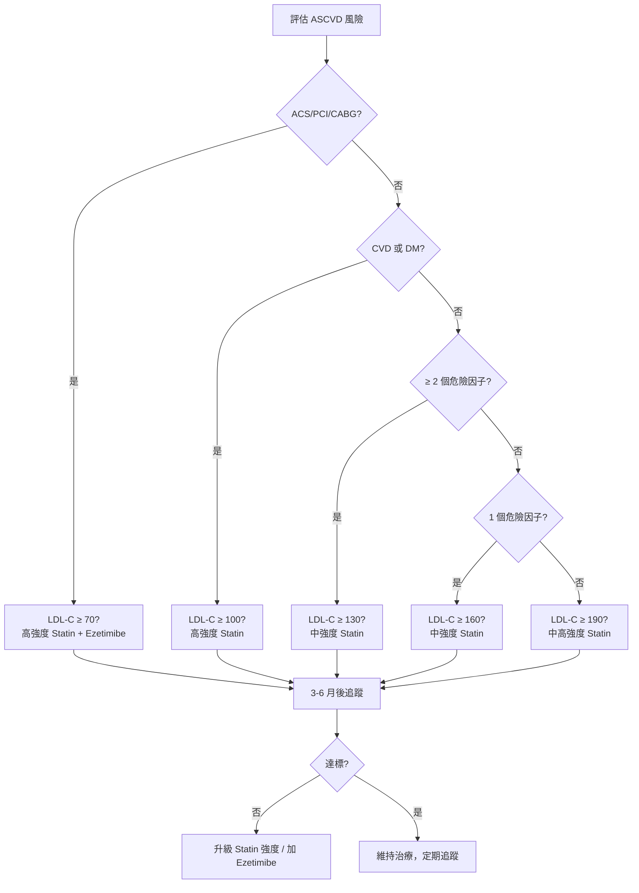

# 健保降血脂藥物給付規定判定

**健保降血脂藥物給付規定判定 NHI Lipid-Lowering Drug Reimbursement Criteria**

---

<LipidProtocolCalculator />

## 給付規定摘要 Reimbursement Criteria Summary

| 病人分類           | 起始藥物治療血脂值            | 血脂目標值                    | 非藥物治療   |
| ------------------ | ----------------------------- | ----------------------------- | ------------ |
| **ACS / PCI/CABG** | LDL-C ≥ 70 mg/dL              | LDL-C < 70 mg/dL              | 可與藥物並行 |
| **CVD 或 DM**      | TC ≥ 160 或 LDL-C ≥ 100 mg/dL | TC < 160 且 LDL-C < 100 mg/dL | 可與藥物並行 |
| **≥ 2 個危險因子** | TC ≥ 200 或 LDL-C ≥ 130 mg/dL | TC < 200 且 LDL-C < 130 mg/dL | 需先 3–6 月  |
| **1 個危險因子**   | TC ≥ 240 或 LDL-C ≥ 160 mg/dL | TC < 240 且 LDL-C < 160 mg/dL | 需先 3–6 月  |
| **0 個危險因子**   | LDL-C ≥ 190 mg/dL             | LDL-C < 190 mg/dL             | 需先 3–6 月  |

> **非藥物治療**：需先進行 3–6 個月生活方式調整（飲食控制、運動、體重控制、禁菸酒），若仍未達標才給付藥物。ACS/PCI/CABG 及 CVD/DM 病人可與藥物並行。

### 心血管疾病定義 Cardiovascular Disease Definitions

- 冠狀動脈粥狀硬化患者：心絞痛，心導管證實或缺氧性 ECG 變化或負荷性試驗陽性
- 缺血性腦血管疾病：腦梗塞、腦內出血、暫時性腦缺血（TIA）、有症狀之頸動脈狹窄
- 周邊動脈疾病（PAD）：ABI < 0.9 或影像學確認之周邊血管阻塞

### 危險因子定義 Risk Factor Definitions

1. **高血壓**：BP ≥ 140/90 mmHg，或正在服用降血壓藥物（含列屬健保給付之慢性病範圍）
2. **男性 ≥ 45 歲，女性 ≥ 55 歲或停經者**
3. **早發性冠心病家族史**：男性一等親 ≤ 55 歲 或 女性一等親 ≤ 65 歲 發病
4. **HDL-C < 40 mg/dL**（無論男女）
5. **吸菸**：仍有抽菸習慣者（未戒菸者要求藥物治療應自費）

> 註：糖尿病（DM）本身視為心血管疾病等位症（CVD risk equivalent），歸類於 CVD 或 DM 組，不計入危險因子個數計算。

## ASCVD 風險評估

台灣高血壓學會/心臟學會建議以 **ASCVD Risk Estimator** 或 **Framingham Risk Score** 進行 10 年風險分層：

| 風險等級 | 10 年 ASCVD 風險 | 處理建議                                        |
| -------- | ---------------- | ----------------------------------------------- |
| 低風險   | < 5%             | 生活型態調整，不需常規藥物                      |
| 中風險   | 5% – < 7.5%      | 生活型態調整，評估是否起始中強度 Statin         |
| 中高風險 | 7.5% – < 20%     | 建議中強度 Statin，若 LDL-C 仍 ≥ 100 可考慮升級 |
| 高風險   | ≥ 20%            | 高強度 Statin，目標 LDL-C < 100 mg/dL           |

> 風險計算工具：https://tools.acc.org/ASCVD-Risk-Estimator-Plus/

## 藥物治療建議（臨床參考） Pharmacotherapy Recommendations (Clinical Reference)

### ASCVD 治療決策流程

#### Statin 強度

| 條件                                                              | 建議強度      | 藥物範例                                                                   |
| ----------------------------------------------------------------- | ------------- | -------------------------------------------------------------------------- |
| ACS/PCI/CABG 或 CVD/DM 且 LDL-C ≥ 100，或 LDL-C ≥ 190 mg/dL       | 高強度        | Atorvastatin 40–80 mg QD、Rosuvastatin 20–40 mg QD                         |
| ≥ 2 個危險因子且 LDL-C ≥ 130，或 1 個危險因子且 LDL-C ≥ 160 mg/dL | 中強度        | Atorvastatin 10–20 mg QD、Rosuvastatin 5–10 mg QD、Simvastatin 20–40 mg QD |
| 未達上述條件                                                      | 暫不需 Statin | —                                                                          |

#### Statin 強度分類對照表

| 項目             | 高強度 High Intensity                        | 中強度 Moderate Intensity                                                                                                                                                   | 低強度 Low Intensity                                                            |
| ---------------- | -------------------------------------------- | --------------------------------------------------------------------------------------------------------------------------------------------------------------------------- | ------------------------------------------------------------------------------- |
| LDL-C 平均降幅   | ≥ 50%                                        | 30%–49%                                                                                                                                                                     | < 30%                                                                           |
| TG 平均降幅\*    | 約 25–35%                                    | 約 15–25%                                                                                                                                                                   | 約 < 15%                                                                        |
| 藥物（每日劑量） | Atorvastatin 40–80 mg、Rosuvastatin 20–40 mg | Atorvastatin 10–20 mg、Rosuvastatin 5–10 mg、Simvastatin 20–40 mg、Pravastatin 40–80 mg、Lovastatin 40 mg、Fluvastatin XL 80 mg、Fluvastatin 40 mg BID、Pitavastatin 1–4 mg | Simvastatin 10 mg、Pravastatin 10–20 mg、Lovastatin 20 mg、Fluvastatin 20–40 mg |

\* TG 降幅依基礎值與個體差異甚大，僅供概略參考。

#### Ezetimibe 給付規定

| 條件               | 給付限制                                                                                                                  |
| ------------------ | ------------------------------------------------------------------------------------------------------------------------- |
| **ACS 住院期間**   | 住院期間使用 Atorvastatin 40–80 mg 或 Rosuvastatin 20–40 mg 仍控制不佳（LDL-C ≥ 70 mg/dL），可合併給付 Ezetimibe 10 mg QD |
| **糖尿病合併 CVD** | 使用高強度 Statin 達 3 個月以上，LDL-C ≥ 100 mg/dL，可合併給付                                                            |
| **FH 患者**        | 參見 FH 給付規定                                                                                                          |
| 其餘情況           | 不建議常規合併使用，應先嘗試 Statin 最大耐受劑量                                                                          |

#### PCSK9 抑制劑給付規定

| 項目           | 給付條件                                                                                                                              |
| -------------- | ------------------------------------------------------------------------------------------------------------------------------------- |
| **適用對象**   | 已接受最高耐受劑量 Statin + Ezetimibe 治療 ≥ 3 個月，LDL-C 仍未達標之**心血管高風險患者**                                             |
| **LDL-C 門檻** | ACS/PCI/CABG：LDL-C ≥ 70 mg/dL；CVD/DM：LDL-C ≥ 100 mg/dL；FH：LDL-C ≥ 130 mg/dL（且合併 CVD 或 ≥ 2 危險因子）                        |
| **藥物種類**   | **Evolocumab (Repatha)** 140 mg SC Q2W 或 420 mg SC QM；**Inclisiran (Leqvio)** 284 mg SC 單次，3 個月後再給予一次，此後每 6 個月一次 |
| **事先審查**   | 需事前審查（專案申請），有效期 6 個月，期滿需檢附追蹤資料申請續用                                                                     |
| **續用條件**   | 治療後 LDL-C 較 baseline 下降 ≥ 30%                                                                                                   |
| **排除條件**   | Severe HF (NYHA Fc IV)、Malignancy 預後 < 2 年、未控制甲狀腺功能低下、懷孕/哺乳                                                       |

#### TG 分級處理流程

| TG 範圍       | 心血管風險       | 胰臟炎風險 | 處理建議                                                                                       |
| ------------- | ---------------- | ---------- | ---------------------------------------------------------------------------------------------- |
| < 150 mg/dL   | 正常             | 極低       | 維持                                                                                           |
| 150–199 mg/dL | 邊緣升高         | 低         | Statin（若合併 LDL-C 偏高）、生活型態調整                                                      |
| 200–499 mg/dL | 升高（殘餘風險） | 中         | **Statin 優先**（若 LDL-C 未達標）；TG 仍 ≥ 200 且 TC/HDL-C > 5 或 HDL-C < 40 → 加 Fenofibrate |
| ≥ 500 mg/dL   | 高               | **高**     | **優先降 TG 預防胰臟炎**：Fenofibrate 或 Gemfibrozil ± Omega-3，目標 TG < 500                  |

> **台灣常見 fibrate 選擇**：Fenofibrate 145 mg QD（較少交互作用）、Gemfibrozil 600 mg BID（注意與 Statin 併用增加肌肉毒性風險，不建議合併使用）。

#### Statin 藥物交互作用一覽表

| 藥物                           | 影響 Statin 之機轉                   | 受影響 Statin                         | 處理建議                                                                  |
| ------------------------------ | ------------------------------------ | ------------------------------------- | ------------------------------------------------------------------------- |
| **Gemfibrozil**                | OATP1B1/UGT 抑制 → Statin AUC ↑ 2–3x | 所有 Statin（尤其 Rosuvastatin）      | **避免併用**；改用 Fenofibrate                                            |
| **Amiodarone**                 | CYP3A4 抑制                          | Simvastatin, Atorvastatin, Lovastatin | Simvastatin 劑量 ≤ 20 mg/day                                              |
| **CCB (Diltiazem/Verapamil)**  | CYP3A4 抑制                          | Simvastatin, Atorvastatin, Lovastatin | Simvastatin 劑量 ≤ 10 mg/day（Diltiazem）或避免                           |
| **Macrolide antibiotics**      | CYP3A4 強抑制                        | Simvastatin, Atorvastatin, Lovastatin | 治療期間暫停 Statin 或改用 Rosuvastatin/Pitavastatin                      |
| **Azole antifungals**          | CYP3A4 強抑制                        | Simvastatin, Atorvastatin, Lovastatin | 治療期間暫停 Statin                                                       |
| **Protease inhibitors**        | CYP3A4 抑制 / OATP 抑制              | 多種 Statin                           | 避免 Simvastatin/Lovastatin；Atorvastatin 劑量限制                        |
| **Ciclosporin**                | OATP1B1/CYP3A4 抑制                  | 多種 Statin                           | 避免 Simvastatin/Rosuvastatin；其他 Statin 低劑量開始                     |
| **Warfarin**                   | 代謝競爭（CYP 同功酶）               | 所有 Statin（尤其 Simvastatin）       | 監測 INR，Statin 起始/調整劑量時加強 INR 追蹤                             |
| **Fibrates (non-Gemfibrozil)** | 藥效加成，肌肉風險↑                  | 所有 Statin                           | 無顯著 PK 交互作用，但仍需監測肌肉症狀                                    |
| **Grapefruit juice**           | CYP3A4 腸道抑制（首渡代謝↓）         | Simvastatin, Atorvastatin, Lovastatin | 避免大量攝取（> 1 L/day）；Rosuvastatin/Pitavastatin/Pravastatin 不受影響 |

> **通則**：Rosuvastatin 與 Pitavastatin 受 CYP 代謝影響最小，具藥物交互作用風險之患者可優先選用。

## Ezetimibe

- **作用機制**：抑制小腸膽固醇吸收（NPC1L1 抑制劑），不經 CYP 代謝
- **劑量**：10 mg QD
- **LDL-C 降幅**：約 15–20%（單用）；與 Statin 併用具加成效果（額外降 15–20%）
- **安全性**：幾乎無藥物交互作用，副作用極少
- **給付門檻**：詳見上方 Ezetimibe 給付規定

## PCSK9 抑制劑

| 藥物                     | 劑量                   | 頻率                       | LDL-C 降幅 | 給付門檻         |
| ------------------------ | ---------------------- | -------------------------- | ---------- | ---------------- |
| **Evolocumab (Repatha)** | 140 mg SC 或 420 mg SC | Q2W 或 QM                  | ~60%       | 詳見上方給付規定 |
| **Inclisiran (Leqvio)**  | 284 mg SC              | 初次 + 第 3 個月，此後 Q6M | ~50%       | 同 PCSK9i 規定   |

## 家族性高膽固醇血症（FH）診斷與治療

### Dutch Lipid Clinic Network (DLCN) 診斷標準

| 項目         | 條件                                                              | 分數 |
| ------------ | ----------------------------------------------------------------- | ---- |
| **家族史**   | 一等親有早發性冠心病（男 < 55 / 女 < 65）或已知 FH                | 1    |
|              | 一等親有 TC > 290 mg/dL 或二等親有 Tendon xanthoma / 早發性冠心病 | 2    |
| **個人病史** | 有早發性冠心病（男 < 55 / 女 < 65）                               | 2    |
|              | 有早發性腦血管/周邊動脈疾病                                       | 1    |
| **理學檢查** | Tendon xanthoma                                                   | 6    |
|              | Arcus cornealis（< 45 歲）                                        | 4    |
| **LDL-C**    | ≥ 330 mg/dL                                                       | 8    |
|              | 250–329 mg/dL                                                     | 5    |
|              | 190–249 mg/dL                                                     | 3    |
|              | 155–189 mg/dL                                                     | 1    |
| **基因檢測** | LDLR、APOB、PCSK9 致病性變異                                      | 8    |

| 總分 | 診斷             |
| ---- | ---------------- |
| > 8  | 確定 Definite FH |
| 6–8  | 疑似 Probable FH |
| 3–5  | 可能 Possible FH |

### FH 治療建議

- **給付規定**：FH 患者若經飲食控制 3–6 個月後 LDL-C ≥ 190 mg/dL，即可給付 Statin 治療。
- **建議強度**：起始高強度 Statin，未達標（LDL-C < 160 且降幅 ≥ 30%）加 Ezetimibe，仍未達標考慮 PCSK9i（需符合給付門檻）。
- **家族篩檢**：確診 FH 患者建議一等親進行血脂篩檢（Cascade screening）。
- **兒童 FH**：LDL-C ≥ 190 mg/dL 或 ≥ 160 mg/dL 且合併 FH 家族史，可考慮從 8–10 歲起始 Statin。

## 用藥安全與監測 Drug Safety & Monitoring

### 肝功能監測 Liver Function Monitoring

- 治療前檢測 baseline ALT/AST。
- 若 ALT/AST 上升 < 3× ULN 且無症狀 → 不需常規停藥，持續監測。
- 若 ALT/AST ≥ 3× ULN → 確認是否為 Statin 相關，可考慮減量、換藥（如 Pitavastatin/Rosuvastatin 肝臟代謝較少）、或暫停。
- **不建議常規監測肝功能**（AHA/ACC 2018：僅 baseline 及臨床有必要時）。

### 肌肉症狀監測 Muscle Symptom Monitoring

- 治療前檢測 baseline CK。
- 肌肉症狀（酸痛、壓痛、無力）為 Statin 最常見副作用：
  - CK 正常或輕微上升（< 4× ULN）伴輕微症狀 → 觀察，確認症狀關聯性。
  - CK 4–10× ULN 伴中度症狀 → 減量或暫停 2–4 週，重新評估。
  - CK > 10× ULN 或 有明顯無力/尿色變深 → 立即停藥，懷疑橫紋肌溶解症，靜脈輸液。
- **再挑戰策略**：症狀緩解後可嘗試：換藥（不同代謝途徑）、減量、或改用低強度 Statin。
- **不可逆因素**：高齡（> 80 歲）、腎功能不全、甲狀腺低下、多重藥物、低體重。

### 血糖影響 Glycemic Effects

- Statin（尤其高強度）可能輕度增加新發生糖尿病風險（～0.1–0.3% annually），但 CV 獲利遠大於風險。
- 不需常規監測 HbA1c，但 baseline 糖尿病風險高者建議測空腹血糖。

## 特殊族群 Special Populations

| 族群                  | 建議                                                                                                                                                                 |
| --------------------- | -------------------------------------------------------------------------------------------------------------------------------------------------------------------- |
| **懷孕與哺乳**        | Statin 懷孕分級 X，懷孕及哺乳期間應停藥；懷孕期間高血脂通常不需藥物治療；嚴重 FH 可考慮 LDL apheresis                                                                |
| **兒童/青少年**       | 一般建議 8–10 歲以上；首選 Pravastatin 10–20 mg 或 Rosuvastatin 5–10 mg；目標 LDL-C < 160 mg/dL（無其他風險因子）                                                    |
| **老年人（≥ 75 歲）** | 一級預防證據較弱，需個別化評估；二級預防仍建議使用中強度 Statin；注意衰弱、腎功能、交互作用                                                                          |
| **慢性腎臟病**        | Statin 於 CKD 3–5 期仍有明確 CV 獲利；Atorvastatin 不需調整劑量；Rosuvastatin 於 CKD 4–5 期建議 5–10 mg QD（台灣仿單限制 5 mg 起始）；Pravastatin 安全性高，不需調整 |
| **器官移植**          | 注意 Ciclosporin/Tacrolimus 交互作用；首選 Pravastatin 10–20 mg 或 Atorvastatin 10 mg（監測濃度）                                                                    |
| **HIV 患者**          | 注意 Protease inhibitors 交互作用；避免 Simvastatin/Lovastatin；首選 Rosuvastatin 5–10 mg 或 Pitavastatin（無顯著交互作用）                                          |

## TG 高於 500 mg/dL 治療流程

  TG ≥ 500 mg/dL
  
↓

  

    

      
排除次要原因 Exclude Secondary Causes

    

    <ul style="list-style:none;margin:0;padding:0.6rem 0.9rem;">
      <li style="padding:0.2rem 0;display:flex;align-items:flex-start;gap:0.5rem;">未控制糖尿病 Uncontrolled DM</li>
      <li style="padding:0.2rem 0;display:flex;align-items:flex-start;gap:0.5rem;">飲酒 Alcohol</li>
      <li style="padding:0.2rem 0;display:flex;align-items:flex-start;gap:0.5rem;">藥物 Drugs：Corticosteroid、HRT、β-blocker、Thiazide</li>
      <li style="padding:0.2rem 0;display:flex;align-items:flex-start;gap:0.5rem;">甲狀腺低下 Hypothyroidism</li>
      <li style="padding:0.2rem 0;display:flex;align-items:flex-start;gap:0.5rem;">腎病 / 肝病 Renal / Liver disease</li>
    </ul>
  

  
↓

  立即開始 Fibrate Start Fibrate
  
↓

  Fenofibrate 可用？Available?
  
↓

  

    

      

        
是 Yes

      

      

        
Fenofibrate

        
145 mg QD

      

    

    

      

        
否 No

      

      

        
Gemfibrozil

        
600 mg BID

        
⚠ 不可與 Statin 併用

      

    

  

  
↓

  

    

      
加 Omega-3 2–4 g/day

      
若 TG 仍 &gt; 500 mg/dL

    

  

  
↓

  

    

      
🎯 目標 TG &lt; 500 mg/dL

      
預防胰臟炎 Prevent pancreatitis

    

  

  
↓

  

    

      
TG &lt; 500 穩定後：評估是否需要 Statin

      
依 ASCVD 風險 · Assess statin per ASCVD risk

    

  

## 監測規定 Monitoring Requirements

- 第一年每 3–6 個月抽血檢查一次
- 第二年以後每 6–12 個月一次
- 注意：肝功能異常、橫紋肌溶解症等副作用
- 未達給付目標者：應嘗試 **Statin 升級** 或 **合併 Ezetimibe** 後才考慮 PCSK9i

## 參考文獻 References

1. 2024 臺灣血脂指引 (Taiwan Lipid Guidelines)
2. 2023 臺灣高血壓學會 ASCVD 風險評估共識
3. 2024 健保給付規定（降血脂藥物部分）
4. AHA/ACC 2018 Cholesterol Guidelines
5. ESC/EAS 2019 Dyslipidaemia Guidelines
6. DLCN Diagnostic Criteria for FH
